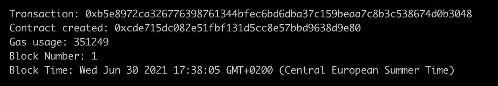

Develop an Ethereum smart contract with Flask and Vyper
#######################################################
:date: 2021-06-27
:author: Tom
:category: ETH
:tags: Etherum, Vyper, Blockchain
:slug: eth-contract-python-vyper-flask
:description: A full example on how to implement a real world Etherum smart contract with Python, Flask and Vyper.
:amazon_product: placement=B07B8Q2G3K&asins=B07B8Q2G3K&linkId=e3eb59d8fb9932d597eff95dae8cd38a

This is an updated version of Neha Ghogales blog post `How to develop Ethereum contract using Python Flask?`_

Requirements:
-------------

 * Python 3.9
 * Web3 (version 5.x)
 * Node (version 10) - Used for Ganache
 * Ganache (as personal Etherum blockchain for testing)

Installation:
-------------

Create a Python virtual environment and install dependencies:

.. code-block:: bash

  $ python -m venv smart-contract
  $ cd smart-contract
  $ bin/pip install web3 flask flask-restful marshmallow vyper

Install Ganache Etherum development environment:

.. code-block:: bash

 $ npm install -g ganache-cli

Process:
--------

Instead of Solidity I'm using Vyper for the smart contract here. We create a file
called *users.vy*:

.. code-block:: python

    # @version ^0.2.0

    struct User_obj:
        name: String[50]
        gender: int128

    MALE: constant(int128) = 0
    FEMALE: constant(int128) = 1
    OTHER: constant(int128) = 2

    user: User_obj

    @external
    def setUser(name: String[50], gender: String[10]):
        assert gender == "male" or gender == "female" or gender == "other", "gender must be 'male', 'female' or 'other'"
        _gender_code: int128 = OTHER
        if gender == "male":
            _gender_code = MALE
        elif gender == "female":
            _gender_code = FEMALE
        else:
            _gender_code = OTHER
        self.user = User_obj({name: name, gender: _gender_code})

    @external
    @view
    def getUser() -> (String[50], String[10]):
        _gender: String[10] = "other"
        if self.user.gender == MALE:
            _gender = "male"
        elif self.user.gender == FEMALE:
            _gender = "female"
        else:
            _gender = "other"
        return self.user.name, _gender

Our smart contract stores a "User object" in the blockchain. It contains a name and
a gender code. We have a setter-method *setUser* to set the **name** and the **gender**
and a getter-method *getUser* to retrieve it.

As in the original blog post, we use `web3`_ to deploy the smart contract and
interact with it. The syntax is verion 5 of web3.

.. code-block:: python

    import json
    from vyper.cli import vyper_compile
    from web3 import Web3

    # web3.py instance
    w3 = Web3(Web3.HTTPProvider("http://127.0.0.1:8545"))

    def deploy_contract(contract_interface):
        # Instantiate and deploy contract
        contract = w3.eth.contract(
            abi=contract_interface["abi"], bytecode=contract_interface["bytecode"]
        )
        # Get transaction hash from deployed contract
        tx_hash = contract.constructor().transact({'from': w3.eth.accounts[1]})

        # Get tx receipt to get contract address
        tx_receipt = w3.eth.wait_for_transaction_receipt(tx_hash)
        return tx_receipt["contractAddress"]

    def deploy_n_transact(file_path):
        output_formats = ["bytecode", "abi"]
        contract = vyper_compile.compile_files(file_path, output_formats)[file_path[0]]
        contract_address = deploy_contract(contract)
        return contract_address, contract["abi"]

    # Compile and deploy Vyper source code
    contract_address, abi = deploy_n_transact(['user.vy'])
    data = {
        "abi": abi,
        "contract_address": contract_address
    }
    with open('data.json', 'w') as outfile:
        json.dump(data, outfile, indent=4, sort_keys=True)

Deploying the smart contract gives us the following result:

|Deploy smart contract|

Because we don't need the string library, we save a lot of gas. Yeah!

.. code-block:: python

    def check_gender(data):
        valid_list = ["male", "female", "other"]
        if data not in valid_list:
            raise ValidationError(f"Invalid gender. Valid choices are {valid_list}")

We add *other* as additional valid option for gender.

.. code-block:: python

    # api to set new user every api call
    @app.route("/blockchain/user", methods=["POST"])
    def transaction():
        w3.eth.defaultAccount = w3.eth.accounts[1]
        with open("data.json", "r") as f:
            datastore = json.load(f)
        abi = datastore["abi"]
        contract_address = datastore["contract_address"]

        # Create the contract instance with the newly-deployed address
        user = w3.eth.contract(
            address=contract_address,
            abi=abi,
        )
        body = request.get_json()
        try:
            result = UserSchema().load(body)
        except ValidationError as err:
            return jsonify(err.messages), 422

        tx_hash = user.functions.setUser(result["name"], result["gender"])
        tx_hash = tx_hash.transact()
        # Wait for transaction to be mined...
        w3.eth.waitForTransactionReceipt(tx_hash)

        user_data = user.functions.getUser().call()
        return jsonify({"data": user_data}), 200

With all our scripts in place we can spin off flask.

.. code-block:: bash

  FLASK_APP=app.py  ../bin/flask run

and interact with the smart contract:

.. code-block:: bash

  curl -H "Content-Type: application/json" --request POST -d '{"name":"Jane Doe","gender":"other"}' http://localhost:5000/blockchain/user
  {"data":["Jane Doe","other"]}

The full code of the example you can find on `Github`_.

.. _How to develop Ethereum contract using Python Flask?: https://medium.com/coinmonks/how-to-develop-ethereum-contract-using-python-flask-9758fe65976e
.. _web3: https://web3py.readthedocs.io/en/stable/
.. _Github: https://github.com/tomgross/basic_user_contract/

